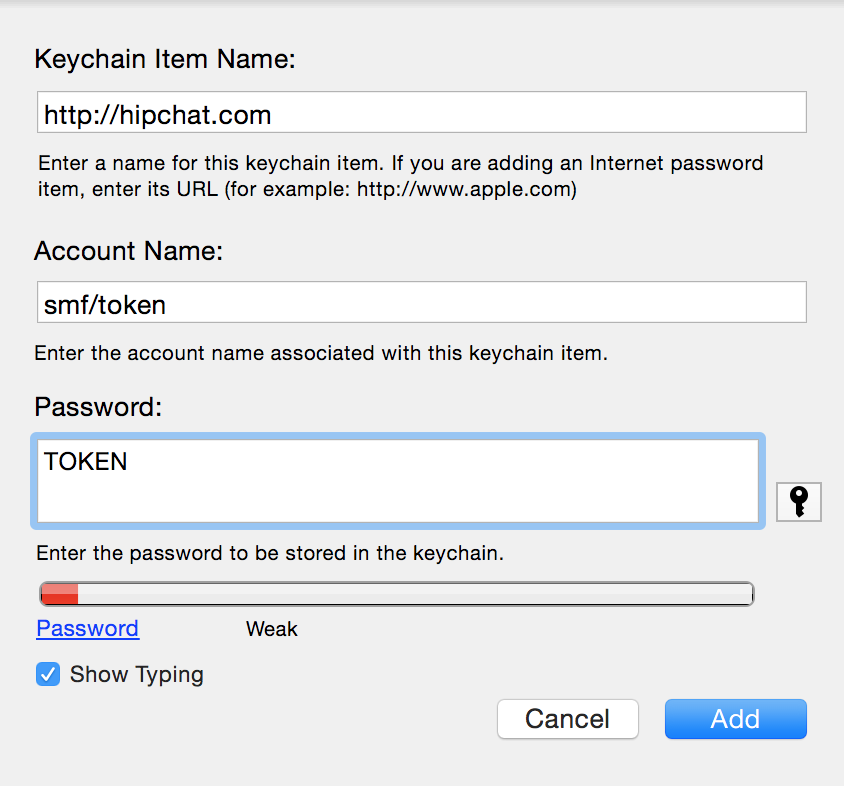

erc-hipchatify.el
=================

This makes chatting via BitlBee to a HipChat server a little more
palatable. Note worth features:

* download HipChat emoticons (eg. (awyeah))
* provide company backend for emoticons and @ completions
* render html and images (png/jpg/gif/svg) via shr
* notify 'here' and 'all' mentions

Usage
-----

.. code:: lisp

    (require 'erc-hipchatify)
    (add-to-list 'erc-modules 'hipchatify)
    (erc-update-modules)

Adding your token to Mac OS X Keychain
--------------------------------------

After you generate your `HipChat token
<https://atlassian.hipchat.com/account/api>`_, you can add it to your keychain
like so:

Which you can then use :code:`/usr/bin/security` to retreive:

.. code:: bash

   $ /usr/bin/security find-internet-password -wa smf/token -s hipchat.com
   TOKEN

Prefixing '@' to usernames
--------------------------

Use the variable :code:`erc-hipchatify-mention-channels` to set the buffer
names that are HipChat channels. For those buffers, any :code:`nick` will be
changed to :code:`@nick`.

Credits
-------

-  `Sean Farley <https://bitbucket.org/seanfarley>`__
